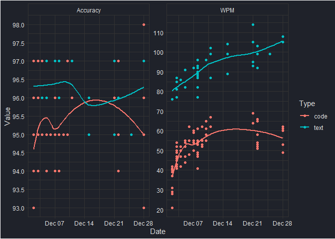

# Moonlander ZSA Review

I bought this thing in late October, a few days after I’d had some pain
in my wrist at work. This thing comes direct from Taiwan (free
shipping!), and the wait was rather agonizing, checking the tracking
every 10 minutes or so. At about $375, this is not a budget keyboard by
any means, but I figured the health benefits avoiding wrist injury was
worth the price tag. Reviews indicated that the build quality is
extremely high, so I went for it.

The TL;DR is that this is a forward-thinking, excellently-devised split
keyboard, able to keep up with all of your configuration needs. The
ortholinear columnar layout perhaps offers some ergonomic benefits, but
I find it less appropriate for gaming. I’m still using my old keyboard
for work until my confidence increases with the Moonlander.

<table>
<thead>
<tr>
<th>
Task
</th>
<th>
Rating
</th>
</tr>
</thead>
<tbody>
<tr>
<td>
<a href="#typing-speed">Typing</a>
</td>
<td>
5/5
</td>
</tr>
<tr>
<td>
<a href="#gaming">Gaming</a>
</td>
<td>
3/5
</td>
</tr>
<tr>
<td>
<a href="#programming">Programming</a>
</td>
<td>
4/5
</td>
</tr>
<tr>
<td>
<a href="#ergonomics">Ergonomics</a>
</td>
<td>
4/5
</td>
</tr>
</tbody>
</table>

## Typing speed

As expected, typing speed ***tanked*** in the first week that I worked
with this keyboard. The manufacturer ZSA provides a terrific app called
Oryx that allows you to configure your layout, test your typing speed on
prose or code, and monitor the keystrokes live – this is what I used
primarily to assess my typing speed.

    datasets = list.files('assets/data/')
    paths    = list.files('assets/data/', full.names = TRUE)
    dates = substr(datasets, start = 1, stop = 10) %>% as.Date()
    last_dataset = paths[which.max(dates)]
    typingData = fread(last_dataset)

    typingData_long = typingData %>%
      tidyr::pivot_longer(cols = c("Accuracy", "WPM"), names_to = "Metric", values_to = "Value")

    ggplot(typingData_long) +
      aes(x = Date, y = Value, color = Type) +
      geom_point() +
      geom_smooth(se = FALSE, formula = y ~ x) +
      facet_wrap(~Metric, scales = 'free') +
      scale_y_continuous(breaks = scales::pretty_breaks(n = 10)) +
      theme_bw() +
      theme(
        panel.background = element_rect(fill = rgb(31/255, 34/255, 42/255)),
        plot.background  = element_rect(fill = rgb(31/255, 34/255, 42/255)),
        strip.background = element_rect(fill = rgb(31/255, 34/255, 42/255)),
        strip.text = element_text(color = 'gray90'),
        legend.background = element_rect(fill = rgb(31/255, 34/255, 42/255)),
        legend.key = element_rect(fill = rgb(31/255, 34/255, 42/255)),
        text = element_text(color = 'gray90'),
        axis.text = element_text(color = 'gray90'),
        panel.grid = element_line(color = 'gray20')
      )

    ## `geom_smooth()` using method = 'loess'

My typing speed dropped to as low as ~20 words per minute for code in
the first few times typing on the Moonlander. This should be expected;
the ortholinear, columnar layout takes time to get used to, and the
location of symbols does not correspond to any existing muscle memory on
QWERTY layouts.

However, over time, my speed has improved; I’ve actually exceeded my
prose typing speed (which was previously typically around 85 WPM)
reaching as high as 114 WPM.

Typing code is going to be slower due to the symbols accessed, but
familiarity with my layout and keeping a layout as intuitive as possible
to existing muscle memory returned my speed to roughly 60 WPM. Accuracy
is fairly constant, around 96% for both types of typing (Oryx does not
register data points for results &lt; 95%).

## Layouts

Speaking of layouts, [my
layout](https://configure.ergodox-ez.com/moonlander/layouts/q9AGA/latest/0)
changed drastically and often compared to the default Moonlander. The
bit that gave me the most trouble was where to keep the symbols:

-   Should I keep them in a dedicated layer?
-   Put them on the left-hand (like the default layout has it),
    right-hand, or both sides?
-   Which symbols should exist on the base layer?

Ultimately, I decided that symbols should all mostly live in their own
layer, but the muscle memory from an ordinary layout should not be
forsaken unless there was a good speed, convenience, or ergonomic
reason.

I used the key where caps-lock normally goes to access the symbols
layer, and moved all of the symbols from the number keys down to the
home row (for the most part). This way, existing muscle memory needs not
be reprogrammed too far.

At this moment, I have 8 layers;

-   Base
-   Arrows (accessed from the semi-colon, like the base layer)
-   Numpad
-   Symbols
-   Gaming
-   Colors
-   Control (media and more arrow keys)
-   R/IDE

## Ergonomics

I believe that the tenting and the split layout does *much* to alleviate
discomfort. Normal keyboards feel somewhat cramped in comparison. I find
myself typing in a more recommended way, arms at a 90° angle, and hands
floating above the keys instead of resting on the wrist-wrest. However,
I am less enamored with the ortholinear layout, and I think that it is
attractive in principle, but has some disadvantages.

The keycaps are the same size as my old board, but keys feel *smaller*
on a staggered layout keyboard. I guess this implies that I feel like my
fingers are traveling farther on average on the Moonlander to hit keys.
I think that there is some merit to this; the staggered layout has keys
oriented in an *almost* hexagonal arrangement; while some keys are
farther to reach on a standard keyboard (“B” is one instance) I think
for the most part the ortholinear layout incurs more travel distance as
the grid arrangement is less space efficient than the hexagonal
arrangement.

For example; take the position of the letter “F”: on an ordinary
staggered layout, my finger can comfortably press F, R, T, G, V, C, and
B without adjusting the rest of my left hand. On the ortholinear layout,
I lose access to the letter “C”; I must use a contortion to hit the
letter with my index finger that disrupts the position of my other
fingers.

One may say that I should instead learn to press “C” with my middle
finger; perhaps this is proper, but it violates my principle of
mitigating repositioning of fingers on standard keyboards. Pressing the
center of the “C” key using the middle finger on a standard layout
requires lifting the index finger; otherwise the middle finger
intersects the index. Better to use the index to press “C”, as it
requires less readjustment. Plus, I’d like to avoid losing my
touch-typing skills with a normal keyboard so I don’t look inept when I
inevitably have to use a standard layout.

This is about the only concern for normal typing, but the grid
vs. hexagonal arrangement has a greater bearing in gaming.

## Gaming

Lots of buttons are available by the left hand between the additional
row on the bottom and the thumb-cluster keys. This is certainly a plus,
although I find the accuracy of the thumb-cluster keys to be lower in
general, so they are reserved for less critical actions, like opening
the map (usually M).

The major concern about the grid layout for gaming is due to what was
mentioned in the previous section; there is more repositioning that
needs to be done due to the grid arrangement.

Take the common gaming situation where digits 1-4 access certain
inventory slots, and WASD are for movement. On a standard keyboard,
while “W” is being held by the middle finger (to move forward), the
digits “2” and “3” are accessible to be pressed by the ring and index
fingers respectively, because they are staggered up and to the left and
right of “W”. In fact, it’s not difficult to press all three
simultaneously.

With the columnar layout, having “W” pressed by the middle finger
results in much greater contortion to access “2” in particular. “3” is
still accessible, but it’s much too far high now due to the vertical
shifting of the layout. Try to press all three simultaneously; it’s not
really easy to do without hitting other keys by mistake, and not without
repositioning the middle-finger on “W”. Add left-shift for sprinting,
and you now can’t really press “2” at all.

“X” is the same way; while “W” is held down, “X” can be easily pressed
using the index finger with a staggered layout, but more movement of the
hand is required with the columnar layout.

Given that equipment swaps typically need to be quick in response to
changing circumstances, I would trade the extra thumb buttons and bottom
row for the easier-to-access “2” and “X” buttons of the staggered
layout. It *is* nicer having WASD in a grid, however; but this is a
small benefit.

Remapping everything to the right by one button (W to E, A to S, D to F,
etc.); fixes the distance traveled to hit “3” by a bit, but it does not
fix the issues with “2” and “X”. In this layout, I remapped shift to
‘A’, and left-control to ‘Z’. This results in a more neutral position
for the hands, which is admittedly nice.

## Programming

Programming uses a lot of symbols, in contrast to ordinary writing, so
accessing those symbols efficiently is what will determine typing speed.
On an ordinary layout, there are only two layers to worry about; the
base layer, and the shifted layer. For me, having the majority of
symbols – not to mention navigation buttons – available in the base
layer is always going to be more efficient than shifting into a layer.
For this reason, while my typing speed is nearly back to normal or
faster with prose, general work functions & programming feels more
effective on the standard layout.

## Build

I think the quality of the build is fantastic. The lighting, materials,
software, and everything else are top-tier.

I replaced the original keycaps with HyperX sculpted keycaps; I was
pressing wrong keys (particularly with the numeric keys) way too often
due to the lack of vertical differentiation between farther keys. Travel
is *far* in some cases; take “5”: the distance on a normal keyboard
replicated on the ortholinear layout brings me to the lower right corner
of “4”. An additional few millimeters of travel are required to hit the
“5” key, making it all the more important to have some vertical profile
to avoid hitting “T” by accident. Sculpted keys made a tremendous
difference in my quality of life using this board.

One gripe I have is the lack of grip; when the keyboard is in a flat
position, the underbody grips contact the surface and prevent the device
from slipping. When the keyboard is in the tented position, however, the
grips no longer contact the surface and the keyboard slides around way
too much. I fixed this with a washcloth underneath the left-hand
component, but there should be friction contacts on the wrist-rest and
the thumb-cluster to avoid this sliding problem.

Last, the wrist-rests are somewhat rattly when weight is shifted between
the left and right side of the rests. Most of the time this isn’t an
issue because my hands are floating above the keys instead of on the
rest. However, they are very comfortable despite being hard plastic, and
I prefer using it over the HyperX wrist-rest for this keyboard
specifically.
