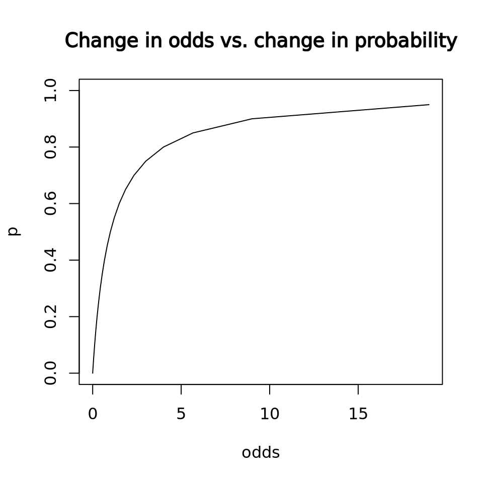
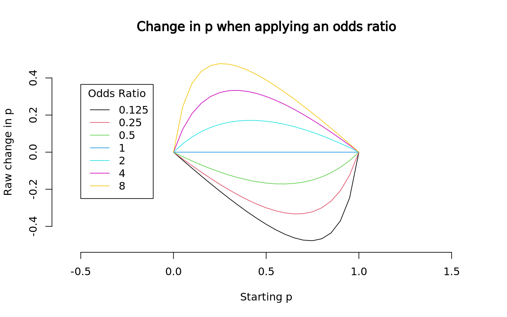

I received a question about interpreting the exponentiated coefficient of a
logistic regression (with a logit link). I don't usually try to understand the
coefficients in terms of odds, because I find them unintuitive. And I never
really explored why I found them unintuitive until I was asked about them.

<!--more-->

## Example

Let's say we're in a game show, and the audience is split into two groups `1` or
`2`. There is some probability group 1 will win a prize, and some probability
group 2 will win.

``` r
set.seed(1)
N = 1000
group = sample(x = c(1,2), size = N, replace = TRUE) # Group index
p_success = c(0.2, 0.22) # Group 1 and 2 respectively
y = rbinom(n = N, size = 1, prob = p_success[group])
df = data.frame(
    group = as.factor(group),
    p = p_success[group],
    y = y
)

df |> head()
```

      group    p y
    1     1 0.20 0
    2     2 0.22 0
    3     1 0.20 0
    4     1 0.20 1
    5     2 0.22 0
    6     1 0.20 0

Here we've intentionally set the probability of group 1 winning to 0.2
and the probability of group 2 winning to 0.22. Group 2 has a very
modest 2% higher chance of winning.

Let's say we have data from prior game shows; we can fit a logistic regression
model to this, and measure the effect of sitting in group 2:

``` r
m = glm(data = df, formula = y ~ group, family = binomial(link = 'logit'))
summary(m)
```


    Call:
    glm(formula = y ~ group, family = binomial(link = "logit"), data = df)

    Coefficients:
                Estimate Std. Error z value Pr(>|z|)    
    (Intercept)  -1.3421     0.1101 -12.186   <2e-16 ***
    group2        0.1614     0.1526   1.058     0.29    
    ---
    Signif. codes:  0 '***' 0.001 '**' 0.01 '*' 0.05 '.' 0.1 ' ' 1

    (Dispersion parameter for binomial family taken to be 1)

        Null deviance: 1056.3  on 999  degrees of freedom
    Residual deviance: 1055.2  on 998  degrees of freedom
    AIC: 1059.2

    Number of Fisher Scoring iterations: 4

We find that the coefficient for group 2 is 0.1614357. What does
this mean?

Without doing much work we can identify that the value is greater than 0, so we
might conclude that group 2 raises the chances of winning, slight as it is. But
we would like to know by how much.

## Interpretation

The linear function of parameters and predictors are transformed to the
probability scale using the logit link, and you can understand the equation two
ways. Either you have this equation (odds):

$$
\left(\frac{p(x)}{1-p(x)}\right) = e^{\left(\beta_0 + \beta_1 x \right)}
$$

or you have this equation (probability):

$$
p(x) = \frac{1}{1 + e^{-\left(\beta_0 + \beta_1 x \right)}}
$$

...taking $p(x)$ to mean $p(Y=1 | x)$ (probability of success, conditional on $x$) and $1-p$ to mean $p(Y=0 | x)$ (probability of failure, conditional on $x$).

In simpler terms, you can interpret the coefficients in terms of the raw
probability of success, or the ratio of the probability of success to the
probability of failure (odds), depending on how you transform them. But
they both depend on this $\exp(\beta_0 + \beta_1 x)$ quantity.

I'm most used to understanding these coefficients on the probability scale, the
second way. It's easy to get the implied probabilities from the model summary
using the `plogis` function, which applies the inverse-logit function.

### Probability Scale

I can extract the probability of success sitting in group 1 $p(Y=1 | \text{group}=1)$ from
the intercept coefficient:

``` r
beta_intercept = unname(coef(m)[1])
beta_group2    = unname(coef(m)[2])
p_group1 = plogis(beta_intercept)
p_group1
```

    [1] 0.2071713

We can see that the probability of winning in group 1 is measured to be
0.21. This is *exactly* equivalent to the proportion of
observations where `y == 1 & group == 1`, the probability of success with group
1.

``` r
# You can use the mean to get the proportion of observations where y == 1
mean(df$y[df$group == 1])
```

    [1] 0.2071713

Now, the probability of winning when seated in group 2 is given when you *sum*
the intercept and the beta coefficient, and then inverse-logit-transform this
number:

``` r
p_group2 = plogis(beta_intercept + beta_group2)
p_group2
```

    [1] 0.2349398

Again, this is exactly equivalent to the proportion of observations where `y == 1 & group == 2`:

``` r
mean(df$y[df$group == 2])
```

    [1] 0.2349398

Nothing magic going on here.

The values for the intercept 0.21 and the beta coefficient for
`group==2` 0.23 correspond roughly to our true group probabilities
which we fixed at the beginning of the simulation to 0.2 and
0.22 for groups 1 and 2, respectively.

Our model would suggest that the difference is not significant; while we know
the truth because we simulated the values, with this amount of data the observed
difference is just not big enough to make a conclusion with certainty. This
makes sense to my mind; a 0.02 difference in probability should take a lot of
data to measure with certainty, right?

More intuitively, if this was a game show and someone said you could pay to
switch seats with them to sit in group 2, you probably wouldn't pay them too
much money because you only gain 2% higher chance to win in group 2.

### Odds

How about odds? Expressing effects in terms of odds ratios is common in medical
literature, and they measure the relative odds of one treatment level against
another. The logistic regression puts this quantity on the log scale, which
makes it equal to the linear function of the parameters.

$$
\log{\left(\frac{p(x)}{1-p(x)}\right)} = \beta_0 + \beta_1 x
$$

$$
\frac{p(x)}{1-p(x)} = \exp(\beta_0 + \beta_1 x)
$$

You can get odds ratio easily by just exponentiating the estimated coefficient
for $\beta_1$.

``` r
# Unname to get rid of names on the vectors
odds_group1 = unname(exp(beta_intercept))
odds_group2 = unname(exp(beta_intercept + beta_group2))
odds_group1
```

    [1] 0.2613065

``` r
odds_group2
```

    [1] 0.3070866

Now, let's remember that an odds number \< 1 means that you're more likely to
fail than succeed, and an odds number \> 1 means you're more likely to succeed
than fail. **An odds is the ratio of the probability of success to the
probability of failure.**

Here we see that the odds of winning when sitting in group 1 is 0.26,
and the odds of winning when sitting in group 2 is 0.31. So
in both cases we're more likely to fail than win, but we're just slightly more
likely to succeed with group 2.

In other words, when `group == 1`, you are roughly
3.83x
as likely to fail than win, and when `group == 2`, you are roughly
3.26x
as likely to fail than win.

Using the odds formulation, we can get a new quantity by exponentiating the
`beta_group2` parameter directly:

``` r
exp(beta_group2)
```

    [1] 1.175197

This is the relative increase/decrease of the odds when you sit in group 2 over
group 1 -- the *odds ratio*. To see why this is:

``` r
# Log of odds when group == 1
odds_group1 = exp(beta_intercept)
# Log of odds when group == 2
odds_group2 = exp(beta_intercept + beta_group2)
# Rearrange
odds_group2 = exp(beta_intercept) * exp(beta_group2)
odds_group2 = odds_group1 * exp(beta_group2)
# The log of odds when x == 1 divided by the log of odds when group == 2
odds_group2 / odds_group1 = exp(beta_group2)
```

Finally we show this numerically:

``` r
exp(beta_group2) == (odds_group2 / odds_group1)
```

    [1] TRUE

So we can say that our odds of winning by sitting in group 2 is 18%
higher than when sitting in group 1; or, the odds ratio is 1.1751969.

Now consider the same situation as before: someone asks you to pay them switch
seats so you can sit in group 2, and they tell you it will raise your odds of
winning by 18% -- that sounds like a lot!! By phrasing it that way I
think I'd be willing to pay more!

But I think it's much more relatable to human nature to think in terms of
probabilities; we *know* the probability of success in group 2 is only 2%
higher, we simulated it that way. But an 18% increase in odds seems
disproportionately big, and doesn't really seem that useful to communicate.

## The problem with odds ratios

I think that odds ratios are super unintuitive. But I also think that they hide
more information than they give, and that your understanding of the situation is
incomplete until you know the probability of success.

If I tell you I can change your odds of winning by 50%, is that meaningful to
you? How much would you pay to increase your odds of winning by 50%? How much
would you pay to avoid lowering your odds of winning by 50%? I submit you can't
make that decision properly without knowing what the probability of success is.

Below is a function that takes a starting probability, and a multiplier to
increase/decrease the odds ratio by some factor. It reports what the initial
probability of success was, the original odds, the new odds, and the new
probability of success:

``` r
change_odds = function(p, odds_ratio) {
    odds = p / (1-p)
    # Multiply odds by odds_ratio to get new odds
    new_odds = odds * odds_ratio
    # Calculate new p
    new_p = plogis(log(new_odds))

    cat(sprintf("p was:\t\t\t\t%0.3f\n", p))
    cat(sprintf("odds were:\t\t\t%0.3f\n", odds))
    cat(sprintf("new odds are:\t\t%0.3f\n", new_odds))
    cat("-------------------------\n")
    cat(sprintf("change in p is:\t\t%0.3f\n", new_p-p))
    cat("-------------------------\n")
    cat(sprintf("new p is:"))
    new_p
}
```

Now let's say my odds were very good to start -- 5x as likely to win than lose.
Since the odds are simply `p / (1-p)`, this tells us that the probability
of success must be `5/6`, or 0.833. To see why, we can rearrange the formula:

    odds = p / (1 - p)
    odds * (1 - p) = p
    odds - odds * p = p
    odds = p + odds * p
    odds = p * (1 + odds)
    odds / (1 + odds) = p

Therefore, an odds of 5 must be equal to a probability of 5/(1+5), or 5/6. What
do I find if I increase my odds of winning by 50%?

``` r
change_odds(p = 5/6, odds_ratio = 1.5)
```

    p was:              0.833
    odds were:          5.000
    new odds are:       7.500
    -------------------------
    change in p is:     0.049
    -------------------------
    new p is:

    [1] 0.8823529

We find that I started off at a very high chance of winning (83%), but maybe I
don't know that figure automatically. Someone tells me that I can pay money to
increase my odds of winning by 50%, from 5x to 7.5x as likely to win. So far
that sounds *great*! I might pay a lot of money to do that!

But then we read on and we see that the new probability of success is 88.2%, up
from 83.3%. That's an increase in probability of 5%. Suddenly this doesn't look
like as great a deal, and I am not willing to pay as much money knowing this.

What happens if my odds *decreased* by 50%? How much would I pay to avoid
decreasing my odds by 50%?

``` r
change_odds(p = 5/6, odds_ratio = 0.5)
```

    p was:              0.833
    odds were:          5.000
    new odds are:       2.500
    -------------------------
    change in p is:     -0.119
    -------------------------
    new p is:

    [1] 0.7142857

This shows me that I now have 11.9% less probability to win. Knowing the change
in probability I should pay more to avoid losing 11.9% than to gain 5%
probability to win, but the odds ratio changes by 50% in either direction,
failing to give me the information to make an appropriate decision.

Now what happens if my odds started off fairly even? I have a 50% chance of
winning, or 1-to-1 odds. You tell me that I can increase my odds of winning by
50% again, how much should I pay to do so?

``` r
change_odds(p = 1/2, odds_ratio = 1.5)
```

    p was:              0.500
    odds were:          1.000
    new odds are:       1.500
    -------------------------
    change in p is:     0.100
    -------------------------
    new p is:

    [1] 0.6

Now, we see that I gain 10% probability of success going from 50% to 60%, and my
odds have gone from 1-to-1 to 3-to-2. I *should* pay more money for a 10%
increase in winning than a 5% increase to win, and I *should* pay more to avoid
losing 11.9% probability to win over a 10% increase to win, but in every case
above the odds are changing by 50%, with that alone I have no information on
how good of a deal I'm getting by changing seats.

### Expected value

One way to measure what a "good deal" is is to examine the expected value of an
outcome. Our situation is super simple: there's some probability to win, and
someone proposes they'll increase my odds of winning by 50%, or lower it, and I
want to figure out how much money will be worth my while to take the deal.

Let's say the prize is \\\$100. If I have a 83% chance of winning, my expected
value is \\\$83 -- very straightforward. Clearly, I shouldn't spend more than
\\\$17 to raise my expected value to \\\$100, because spending \\\$17 to get
\\\$100 means I've still made \\\$83; the expected value is not different
(even though it's a guaranteed \\\$83, but that aside...).

So in this situation, one percentage point increase corresponds to one dollar of
expected value and I now have an idea of what I should pay to raise my chances
of winning.

Let's say I have 83% chance of winning and someone threatens to make me lose
10%; how much should I pay to avoid that? My expected value would go down to
\\\$73, so I should pay no more than \\\$10 to avoid this situation; it's the
same in this direction too, because if I pay \\\$11 to keep my chance of
winning at 83%, my expected value is \\\$72, one dollar lower than if I'd done
nothing.

One percent change in probability is worth one dollar, very simple in this case.

The problem with odds is that a one unit change in odds does not equate to a
unit change in probability, but our whole perception of whether a change is a
good deal hinges on probability.

``` r
p = seq(0, 1, by = 0.05)
odds = p / (1-p)
plot(odds, p, type = 'l', main = 'Change in odds vs. change in probability')
```



If I've told you your odds went from 1 to 2, 2 to 3, 3 to 4, you might
understand that you are getting a better chance of winning, and you might even
intuit that there is a diminishing return for increasing your odds by 1 unit,
but we *just don't think in terms of odds*. You have to convert it to
probability anyway to figure out how much you should spend to increase your odds
by an additional unit. What's the difference between a million-to-one odds and a
hundred-to-one odds?

``` r
options(scipen = 999)
plogis(log(1e6)) - plogis(log(1e2))
options(scipen = 0)
```

    [1] 0.00989999

Barely anything, just under 1%. But the odds ratio is 10,000! Clearly you
shouldn't pay anything to someone who says they'll increase your odds 10,000x
from 100 to 1,000,000, as impressive as that sounds.

Below, I scale odds for a large number of odds ratios, and plot how those odds
ratios affect the underlying probability (I'm doing nothing more than
multiplying an initial odds by the odds ratio, and finding the resuling
probability).

``` r
p = seq(0, 1, by = 0.05)
ratios = c(0.125, 0.25, 0.5, 1.0, 2.0, 4.0, 8.0)
change_odds_quiet = function(p, odds_ratio) {
    odds = p / (1-p)
    new_odds = odds * odds_ratio
    new_p = plogis(log(new_odds))
    new_p
}
{
    plot.new()
    plot.window(xlim = c(0,1), ylim = c(-0.5,0.5), asp=1)
    for (i in seq_along(ratios)) {
        newp = change_odds_quiet(p, ratios[i])
        lines(p, newp-p, col = i)
    }
    axis(1); axis(2)
    title(main = "Change in p when applying an odds ratio", xlab = "Starting p", ylab = "Raw change in p")
    legend(x = -0.5, y = -0.25, legend = ratios, col = 1:length(ratios), lty=1, title = "Odds Ratio", yjust = 0)
}
```



In the above plot, we see that the effect that an odds ratio has on probability
depends *both* on what the multiplier is and what the original probability of
success is.

So if I tell you I can increase your odds to win eight-fold, you better know
what the probability of winning is before you take the deal.

------------------------------------------------------------------------

### Additional reading

-   ["Thou shalt not report odds ratios", Mark Liberman 2007](http://itre.cis.upenn.edu/~myl/languagelog/archives/004767.html)
-   ["Never Tell Me The Odds (Ratio)", Scott Alexander 2020](https://slatestarcodex.com/2020/04/07/never-tell-me-the-odds-ratio/)

### Acknowledgements

Thanks to [Ken Wong](https://www.kenkoonwong.com/about/) for corrections!

------------------------------------------------------------------------

``` r
sessionInfo()
```

    R version 4.3.2 (2023-10-31)
    Platform: x86_64-conda-linux-gnu (64-bit)
    Running under: Ubuntu 22.04.2 LTS

    Matrix products: default
    BLAS/LAPACK: /home/aw/micromamba/envs/R/lib/libopenblasp-r0.3.26.so;  LAPACK version 3.12.0

    locale:
     [1] LC_CTYPE=C.UTF-8       LC_NUMERIC=C           LC_TIME=C.UTF-8       
     [4] LC_COLLATE=C.UTF-8     LC_MONETARY=C.UTF-8    LC_MESSAGES=C.UTF-8   
     [7] LC_PAPER=C.UTF-8       LC_NAME=C              LC_ADDRESS=C          
    [10] LC_TELEPHONE=C         LC_MEASUREMENT=C.UTF-8 LC_IDENTIFICATION=C   

    time zone: America/New_York
    tzcode source: system (glibc)

    attached base packages:
    [1] stats     graphics  grDevices utils     datasets  methods   base     

    loaded via a namespace (and not attached):
     [1] digest_0.6.34    R6_2.5.1         fastmap_1.1.1    xfun_0.41       
     [5] glue_1.7.0       knitr_1.45       htmltools_0.5.7  rmarkdown_2.25  
     [9] lifecycle_1.0.4  cli_3.6.2        scales_1.3.0     compiler_4.3.2  
    [13] tools_4.3.2      evaluate_0.23    munsell_0.5.0    colorspace_2.1-0
    [17] yaml_2.3.8       rlang_1.1.3      jsonlite_1.8.8  

``` r
system('quarto --version', intern = TRUE)
```

    [1] "1.4.550"

``` r
Sys.time()
```

    [1] "2024-03-07 21:24:59 EST"
