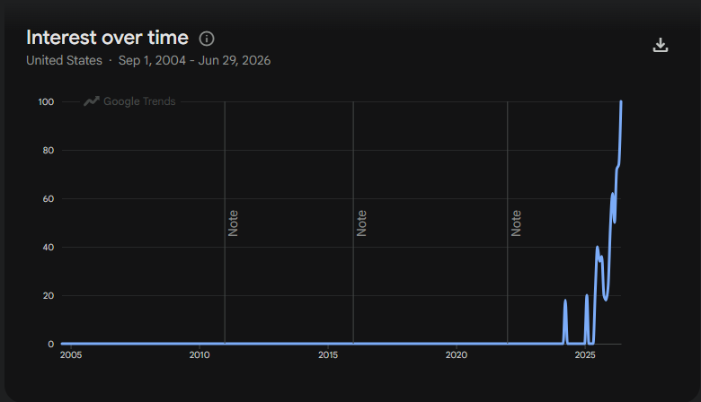

> DHH (01:20:29): The future’s coming whether you like it or not, so you might
as well choose to be excited about it.

A colleague shared this transcript with me: [https://lexfridman.com/dhh-2-transcript](https://lexfridman.com/dhh-2-transcript)

He said he really wants to adopt this viewpoint on AI, its optimism in
particular. So I gave it a read. The whole thing, all 5 hours of it.

<!--more-->

I actually read most of this before learning who DHH was. I guess he made a web
framework and has made plenty of [controversy in the
community](https://victorwynne.com/dhh/). But as I read through this my opinions
soured after DHH dropped such hints as being "__ pilled", "mind viruses", and
general Elon / billionaire fellatio. Big hints. So yeah I developed a tinge of
negativity as I read on but most of that stuff was near the end.

I'm not really here to comment on that stuff. I'm mostly interested in the
espoused viewpoints of AI because this was shared with me in good faith, and
mostly AI as it relates to labor.

My general impression is that this guy conforms to an archetype of the capital
class that seems to be dragging us all along with them into a future many like
me don't really want, offering perspectives from an incredibly advantaged
position.

I had a lot of things I wanted to say, but to keep this thing coherent I'm
focusing on the relationship between those with extensive, successful careers
and those just beginning their careers in the fields AI is disrupting.

# AI optimism prerequires capital

> DHH (04:00:31) Yeah. I think the good thing about my current position is I
really don’t need the money.

Throughout the podcast DHH is vocally excited and unabashedly optimistic about
the direction AI is taking us. Many like him are.

A pattern I'm observing is that the most ardent embracers of AI seem to be the
same ones who have developed a foundation of social, economic, or intellectual
capital that has long since quelled any questions of legitimacy, self worth,
_raison d'etre_, *et cetera*. DHH simultaneously possesses abundant social
capital from his role as an open-source maintainer, intellectual capital from
years of programming experience, and financial capital (evidently); a far cry
from a billionaire, but $40M is nothing to sneeze at.

And to be clear I'm not at all belittling or begrudging them their successes --
I think open-source maintainers in particular are some of the most generous of
us and deserve the recognition.

But it is a lazy, unempathetic, and unobservant option to ride this buoy of
capital over the wave and exclaim about how *fun* agentic engineering is while
the ones building their foundations below the tidal wave are demolished, their
extinguished existence dismissed as an inability to 'adapt'.

Generative AI ushers in a way to leverage their accumulated capital to produce
things that other people can appreciate and insodoing consolidate more capital.
Even if they themselves didn't actually do the work to get it, it's assumed that
even in the absence of AI they could have done it, because they did it before.
With the speed of agentic engineering they can produce great things attributed
directly to them. No wrong statements here.

But I think a lack of empathy is exhibited towards the next generation, one that
can no longer gather merit because the spectre of AI will always loom -- did you
do this, or did AI do this for you? What was your role in it?

# The plight of the uninitiated

> ... DHH (02:30:28) That’s powered by a Python library called Terminal Text Effects.
Really cool library. We’ve been using it since the first day of Omarchy. The
problem with that is it’s written in Python, so when it starts up, especially on
a laptop, and it runs in Python, it uses all of your CPU to do these effects,
and therefore, it means it uses about 30 watts of energy, and it spins up your
fans, and it drains your battery.
>
> DHH (02:30:52) Doesn’t really matter on a local computer, but it does matter
on a laptop. So I thought, “Do you know what? This sounds like a problem for
Rust.” **So first I gave Fable the challenge, and all I told it was, “Here’s the
source code for the Python library,” this TTE library that had a bunch of
dependencies and so forth. “I want a Rust version of this with no dependencies,
a single executable.” Like, that’s what Rust does. So basically, I want it in
Rust. I want it to be pixel perfect, frame by frame, do a full analysis, don’t
stop until you’re finished.**
>
> DHH (02:32:02) … **and I don’t know why I’m surprised, because this
translation job is something we’ve known for a while that AI is pretty good at,
but it was still staggering to me that I could one-shot a full translation of a
Python library I had been using for a year**, that others had been using for
much longer, and turn it into a Rust executable without knowing any Rust,
without looking at the Rust code at all, and produce this executable that I then
told the agent right after, “This is great. Ship it.” It packaged it up as a new
package. It told me, “What do you want it to call?” “Uh, let’s call it TTFX.
Let’s create a new Git repo.” It sets up the Git repo. “Let’s create a new
package, build package for our build system.” It puts that up. “Let’s push it
out.

It's becoming more commonplace for AI systems to actually solve problems on
their own without human intervention -- one-shotting, as it's known. DHH
provides ample examples of the successes and eerieness of the AI (of course
venturing into suggestions of AGI). And I've seen it in my own workplace --
tasks that used to take a quarter now take a week or less, and are more or less
done automatically and correctly up front. And I'm not even using the best of
the best, and I'm not even doing "agentic engineering".

What career foundation can be laid in this environment if you are a new entrant?

No social capital can be built because your coworkers or community would not ask
you for your thoughts and advice when the AI would be more reliable, complete,
and nuanced than you. The respect that comes from a portfolio of work is not
quite the same if it can't be said what ideas were yours and which were the
AI's.

No economic capital can be built from your labor because you won't be able to
sell software much longer if DHH's examples are any indication: you can just
ask for it _de novo_. And if the bar for success is (according to DHH) just
asking for the product in vague terms, then your labor is most *certainly* not
worth what it would have been before; what is your marginal contribution, truly,
that you can point to and hang on to -- especially as a new entrant?

> DHH (00:58:13) You don’t know what a program should do until you play with it.
So in the agentic age, you should resist the temptation to be overly specific
upfront. Be as vague as you can to manifest something, then interact with the
something.
>
> -- DHH, on being rather vague with your instructions

No intellectual capital can be built because as a new entrant your own
knowledge, skills, and experience are (by definition) sorely lacking and so a
dependence on AI will be the only practical path to productivity. What skills
and experience do you pick up that way?

## AGI thought experiment

Let's assume that they've finally done it, they put your company's senior
principal programmer genie wrapped up in an AGI lamp for you to wish upon at
your leisure. Hell, let's make it the senior principal super duper staff
engineer who also worked at Google and dreamed up the search engine. And it's
cheap and emits 0 emissions and actively restores coral reefs with every query
you make. *Incroyable*.

It has cognition beyond what you, statistically, will ever be able to accomplish
no matter how hard you try -- I'm not even making it superhuman at this point,
just much better than you.

If you refuse it at work, your work will be deemed substandard and a risk to the
business; after all you will probably make a thousand times more mistakes than
the super duper staff engineer. So it is senseless not to use it. But how much
to use it?

Would you draw the line at code generation and imagine that your "taste" can
carry the day? But why draw the line there? After all the super duper staff
engineer is probably not _just_ good at programming. It probably would make
better decisions than you, statistically likely old you, when it comes to *any*
of your job functions.

There really isn't anything left for you to do here. Not coding, not design, not
project management, not communication, not presentation -- the super duper staff
senior principal engineer can do it all better.

_If the AI exceeds your capabilities, why would you try?_

*This* is what prevents new accumulation of social, intellectual, economic
capital. We are all, to some extent, artists with our work and care about doing
a good job while at the same time showing others that *our* input matters.
Before AI this was one and the same. Under AI, it becomes impossible for any but
the most gifted to do the latter while still meeting standards for the former.

To be excited about this situation is to be excited about capital consolidation.
The only people who will continue to enjoy social, intellectual, and financial
capital from labor are those who had it to begin with. AI is a path that can
only benefit those with laurels, laurels which can no longer be obtained in the
same way ever again.

The executive capitalist is excited because they see AI as magnifying what
they're already good at -- telling other people (things) to do work for them. In
fact, reading this made me realise AI is actually nothing new to them:
[they already see labor as AI](https://pluralistic.net/2026/01/05/fisher-price-steering-wheel/#billionaire-solipsism). So they continue to reap rewards, whereas the rest of
us have had our individual value propositions knee-capped.

---

I consider Carl Sagan to be a true visionary, a true optimist, a true champion
of mankind, and even he was troubled by the way the future was beginning to
unfold; in nuclear proliferation, in ecological emergency, in the loss of wonder
at the natural world (the *real* world), and increasing dereliction of
understanding. I don't have to post the excerpt from _The Demon Haunted World_
because you have probably seen it a million times in Reddit comment sections.
But here it is anyway.

*Science is more than a body of knowledge; it is a way of thinking. I have a
foreboding of an America in my children's or grandchildren's time — when the
United States is a service and information economy; when nearly all the key
manufacturing industries have slipped away to other countries; when awesome
technological powers are in the hands of a very few, and no one representing the
public interest can even grasp the issues; when the people have lost the ability
to set their own agendas or knowledgeably question those in authority; when,
clutching our crystals and nervously consulting our horoscopes, our critical
faculties in decline, unable to distinguish between what feels good and what's
true, we slide, almost without noticing, back into superstition and darkness.*

So, no, I don't see any reason that we _have_ to choose to be excited about the
future.

---

# P.S.

# An aside on 'taste'

> DHH (00:19:49): The other thing I’d say is that most organizations don’t know
> what they want. They don’t know how to make it better. They’re not
> bottlenecked on implementation. They’re bottlenecked on ideas. They’re
> bottlenecked on vision. They’re bottlenecked on  class='rainbow'>taste.

> Lex Fridman (00:59:06): And it does this iterative thing, and it’s very nice
> and fun. The interaction with the agentic system, if you create a nice
> interface for yourself, it can be super fun, and you’re focusing on the design
> part and the most fun parts of the design part.
>
> DHH (00:59:18): Correct. And this is what humans are really good at.
>
> Lex Fridman (00:59:20): Yeah, taste.

What's with the fucking taste all of a sudden.
Nobody had taste before, [now we have so much taste?](https://trends.google.com/explore?q=taste%2520in%2520programming&date=all&geo=US)

> DHH (00:48:23): **I was about to say agentic. I hate that fucking word.** And the
> reason in part I hate that word is, first of all, it’s become marketing slop
> speak- … at this point. Like, it’s just slapped onto everything. I wish we had
> a different word that just meant AI doing stuff.

